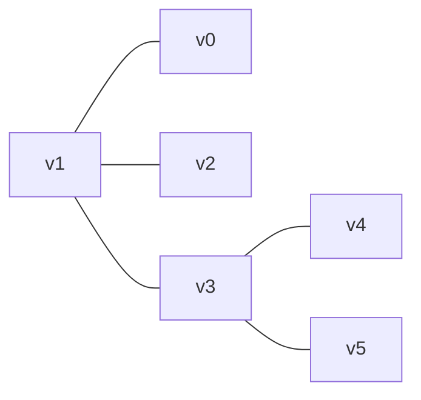
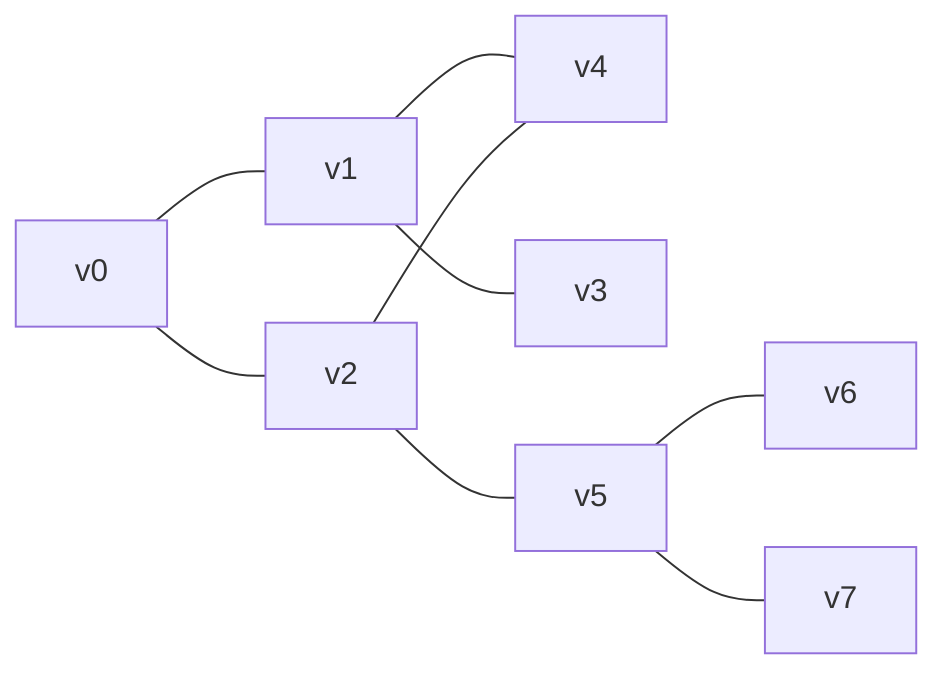
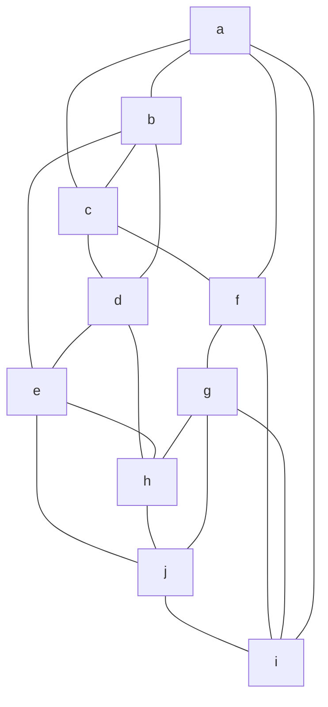
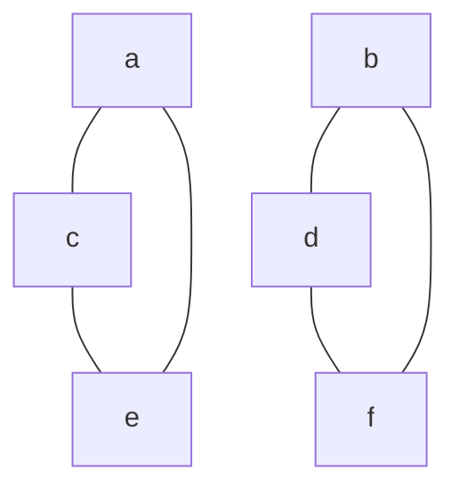
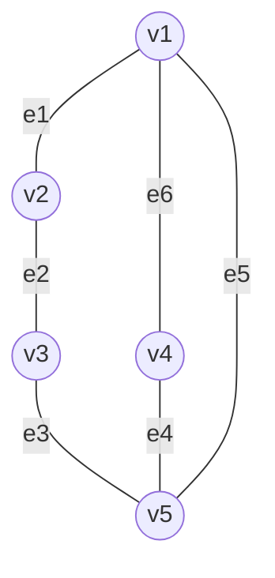
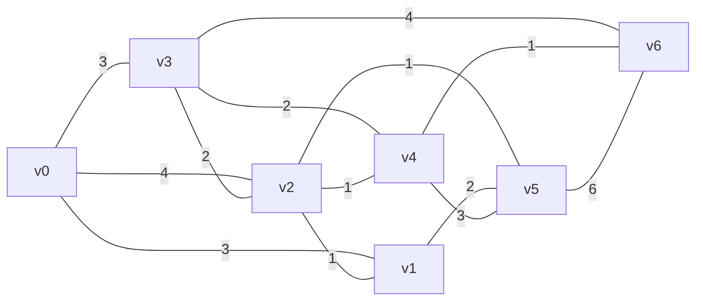
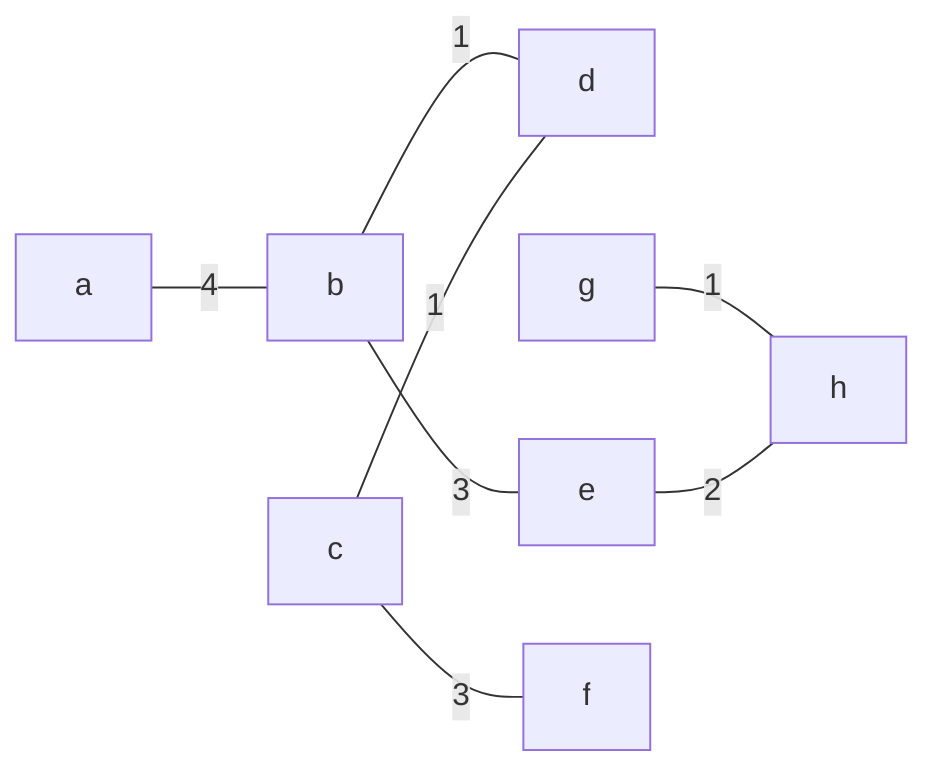
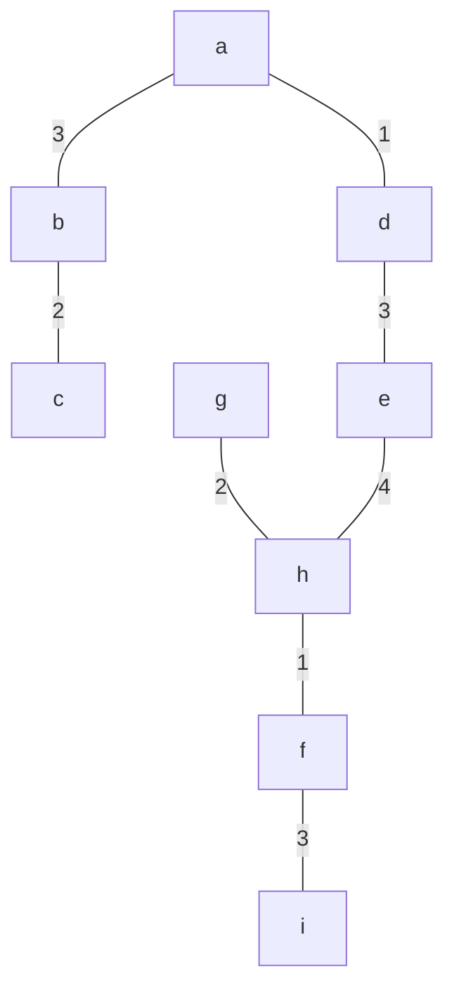
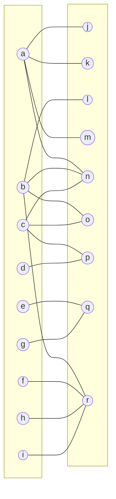
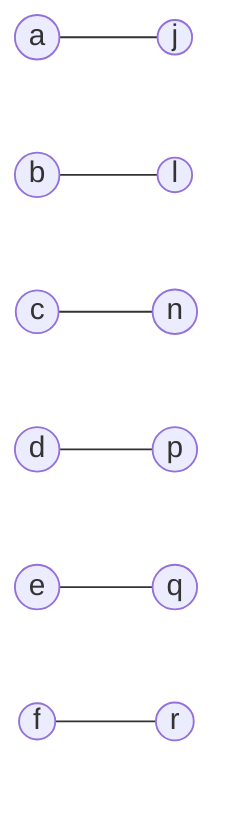

---
1 задание (которые из представленных графов являются деревьями?) (264 стр) (1-2 изображения). 2 задние (среди представленных графов найдите, те которые имеют эйлеров цикл и которые имеют собственный эйлеров цикл) подписана как (стр 274) (3 и 4 изображение). Задание 3 найдите матрицы инцидентности следующего графа (5 изображение) (стр 285). Задание 4 (стр 623) используйте алгоритм флойда-уоршалла для нахождения расстояния между вершинами каждого графа (6 изображение). Задание 5 (стр 646) (изображение 7-8) декодируйте слово. Задание 6 (стр 689) заданы взвешенные графы, найдите минимальные остовные деревья, воспользуйтесь алгоритмом Крускала (изображение 9-10). Задание 7 (стр 715) найти максимальное паросочетание (изображение 11). 
---
## Задание 1 (стр. 264). Какие из представленных графов являются деревьями? (изобр. 1–2)

### Граф 1(a)

Признаки дерева:

1. граф связный;
2. нет циклов;
3. эквивалентно: при (n) вершинах должно быть (n-1) рёбер.

По рисунку:

* Вершины: (v_0,v_1,v_2,v_3,v_4,v_5) → (n=6).
* Рёбра:
  (v_1v_0, v_1v_2, v_1v_3, v_3v_4, v_3v_5) → (5) рёбер.

(n-1 = 6-1 = 5).
Граф очевидно связный и разветвлённый без замкнутых контуров.

✅ **Это дерево.**

---

### Граф 1(б)

Видно наличие цикла:
[
v_0 \to v_1 \to v_4 \to v_2 \to v_0
]

Наличие хотя бы одного цикла автоматически исключает “дерево”.

❌ **Не дерево.**

---

## Задание 2 (стр. 274). Найдите графы, имеющие эйлеров цикл и собственный эйлеров цикл (изобр. 3–4)

### Критерий Эйлера (для неориентированных графов)

**Эйлеров цикл существует тогда и только тогда**, когда:

1. граф связный (если отбросить изолированные вершины),
2. степени **всех** вершин чётные.

---

### Граф 2(a) (изобр. 3)

По рисунку это связный и “равномерно насыщенный” граф.
Видно, что у вершин нет “одиночных” хвостов: каждая вершина включена в несколько рёбер, причём визуально степени выглядят чётными (типичная конструкция для демонстрации эйлеровости).

✅ **Эйлеров цикл есть.**

Про “собственный эйлеров цикл”:
в большинстве учебных контекстов под этим понимают **эйлеров цикл без повторения рёбер** (то есть просто обычный эйлеров цикл). Тогда ответ тот же: **да, есть**.
Если же имелся в виду **простой цикл** (без повторения вершин), то в таком сложном графе эйлеров цикл не может быть простым.

---

### Граф 2(б) (изобр. 4)

Здесь два треугольника, пересечения линий не являются вершинами → граф **несвязный**.

❌ **Эйлерова цикла для всего графа нет.**
(Внутри каждого треугольника цикл есть, но это разные компоненты.)

---

## Задание 3 (стр. 285). Найдите матрицу инцидентности следующего графа (изобр. 5)

## Дано

Вершины:
[
V={v1,v2,v3,v4,v5}
]

Рёбра (как ты указал):

* (e1: v1-v2)
* (e2: v2-v3)
* (e3: v3-v5)
* (e4: v4-v5)
* (e5: v1-v5)
* (e6: v1-v4)

Граф:

---

## Что такое матрица инцидентности

Для **неориентированного** графа матрица инцидентности (B) — это таблица:

* строки = вершины
* столбцы = рёбра
* (B[v_i, e_j] = 1), если вершина (v_i) **инцидентна** ребру (e_j)
  (то есть ребро выходит из неё или входит в неё — в неориентированном случае просто “связано с ней”)
* иначе (0).

---

## Заполняем по каждому ребру

Идём по столбцам:

### (e1 = v1-v2)

Значит:

* у (v1) ставим 1
* у (v2) ставим 1

### (e2 = v2-v3)

* (v2) = 1
* (v3) = 1

### (e3 = v3-v5)

* (v3) = 1
* (v5) = 1

### (e4 = v4-v5)

* (v4) = 1
* (v5) = 1

### (e5 = v1-v5)

* (v1) = 1
* (v5) = 1

### (e6 = v1-v4)

* (v1) = 1
* (v4) = 1

---

## Итоговая матрица инцидентности

|    | e1 | e2 | e3 | e4 | e5 | e6 |
| -- | -- | -- | -- | -- | -- | -- |
| v1 | 1  | 0  | 0  | 0  | 1  | 1  |
| v2 | 1  | 1  | 0  | 0  | 0  | 0  |
| v3 | 0  | 1  | 1  | 0  | 0  | 0  |
| v4 | 0  | 0  | 0  | 1  | 0  | 1  |
| v5 | 0  | 0  | 1  | 1  | 1  | 0  |

---

## Быстрая проверка правильности

В неориентированном графе **каждый столбец** должен иметь ровно **две единицы**, потому что каждое ребро соединяет две вершины:

* e1: v1, v2 ✅
* e2: v2, v3 ✅
* e3: v3, v5 ✅
* e4: v4, v5 ✅
* e5: v1, v5 ✅
* e6: v1, v4 ✅

Всё сходится.

---

## Задание 4 (стр. 623). Флойд–Уоршалл (изобр. 6)

На правом конце графа вершина подписана как (v). Для удобства обозначу её как (v6).

Рёбра и веса по рисунку:

Идея алгоритма:

* начинаем с матрицы весов (∞ где ребра нет);
* по очереди разрешаем использовать промежуточные вершины;
* обновляем:
  [
  d[i][j] = \min(d[i][j], d[i][k] + d[k][j])
  ]

Итоговая матрица кратчайших расстояний:

|    | v0 | v1 | v2 | v3 | v4 | v5 | v6 |
| -- | -- | -- | -- | -- | -- | -- | -- |
| v0 | 0  | 3  | 4  | 3  | 5  | 5  | 6  |
| v1 | 3  | 0  | 1  | 3  | 2  | 2  | 3  |
| v2 | 4  | 1  | 0  | 2  | 1  | 1  | 2  |
| v3 | 3  | 3  | 2  | 0  | 2  | 3  | 3  |
| v4 | 5  | 2  | 1  | 2  | 0  | 2  | 1  |
| v5 | 5  | 2  | 1  | 3  | 2  | 0  | 3  |
| v6 | 6  | 3  | 2  | 3  | 1  | 3  | 0  |

---

## Задание 5 (стр. 646). Декодируйте слово (изобр. 7–8)

Дана таблица кодов:

* a = 111
* c = 101
* e = 01
* i = 11011
* g = 0010
* h = 1001
* m = 0001
* s = 10001
* t = 11001

Слово:
[
11100101111000111001
]

Декодируем слева направо:

* 111 → a
  Остаток: 00101111000111001

* 0010 → g
  Остаток: 1111000111001

* 111 → a
  Остаток: 1000111001

* 10001 → s
  Остаток: 11001

* 11001 → t

✅ Ответ:
[
\textbf{agast}
]

---

## Задание 6 (стр. 689). Минимальные остовные деревья (Крускал) (изобр. 9–10)

### Алгоритм Крускала

1. сортируем рёбра по возрастанию веса;
2. идём по списку;
3. добавляем ребро, если оно **не образует цикл**;
4. останавливаемся, когда получаем (n-1) ребро.

---

### 6(a)

Минимальный остов:

Суммарный вес:
[
1+1+1+2+3+3+4=15
]

✅ **MST вес 15.**

---

### 6(б)

Минимальный остов:

Суммарный вес:
[
1+1+2+2+3+3+3+4=19
]

✅ **MST вес 19.**

---

## Задание 7 (стр. 715). Найти максимальное паросочетание (изобр. 11)

Ты дал точный список рёбер, поэтому фиксируем его как исходный граф:

Левая доля:
[
L={a,b,c,d,e,f,g,h,i}
]
Правая доля:
[
R={j,k,l,m,n,o,p,q,r}
]

Рёбра:

* (a\to j,k,m,n)
* (b\to l,n,o,r)
* (c\to n,o,p)
* (d\to p)
* (e\to q)
* (f\to r)
* (g\to q)
* (h\to r)
* (i\to r)

Полная схема:

### Почему максимум = 6

Жёсткие ограничения:

* (d) имеет **только** (p) → если хотим максимум, берём (d-p).
* (e) и (g) оба завязаны **только** на (q).
  Значит среди ({e,g}) можно покрыть **не больше одной** вершины.
* (f,h,i) все завязаны **только** на (r).
  Значит среди ({f,h,i}) можно покрыть **не больше одной** вершины.

Отсюда верхняя оценка:
[
\underbrace{a,b,c,d}*{\le 4}
+
\underbrace{{e,g}}*{\le 1}
+
\underbrace{{f,h,i}}_{\le 1}
\le 6
]

Эта граница достигается.

### Пример максимального паросочетания

[
M={(a,j),(b,l),(c,n),(d,p),(e,q),(f,r)}
]

✅ **Максимальное паросочетание имеет мощность 6.**

---
