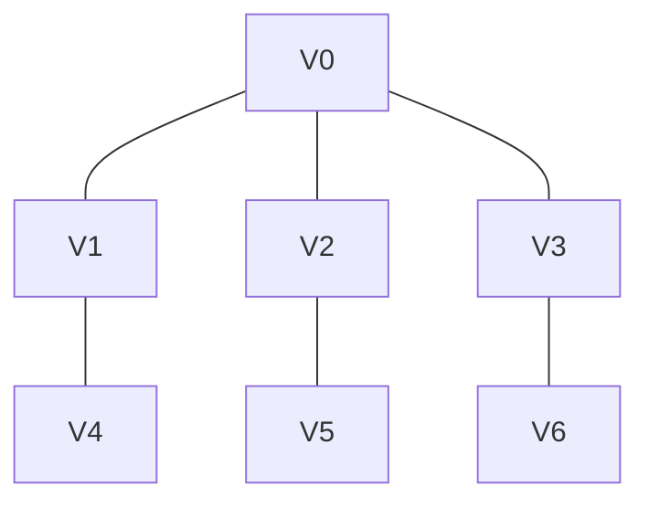
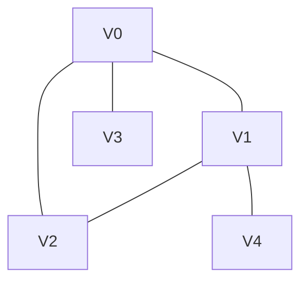
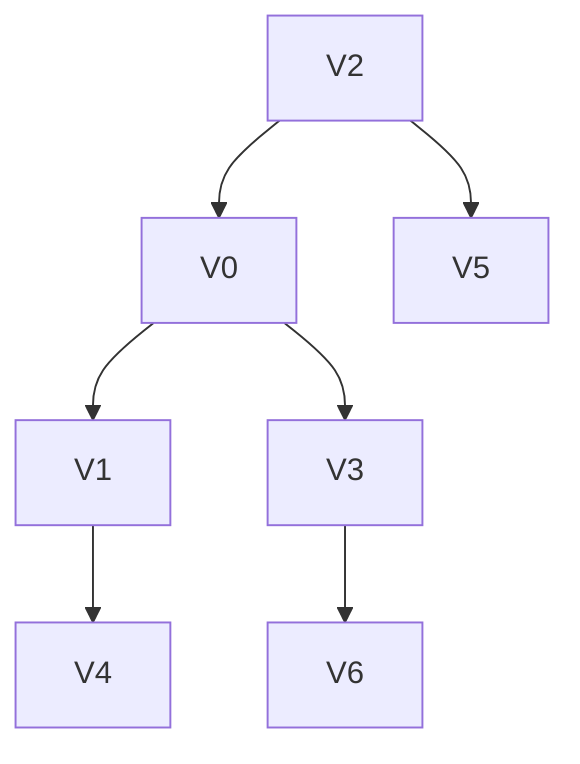
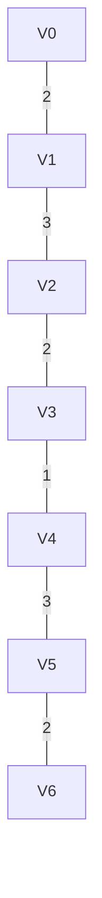

# Решение домашнего задания по теории графов (четный вариант)

## Задание 1: Стр.264, упражнение 1а), 1в)

Согласно учебнику Андерсона "Дискретная математика и комбинаторика" (глава 14, стр. 265), дерево определяется как связный граф без циклов. Также в теореме 14.1.1 доказывается, что граф является деревом тогда и только тогда, когда он связный и содержит ровно $v-1$ ребер, где $v$ - количество вершин.

### 1а) Граф G

**Структура графа:**
- Вершины: $V_0, V_1, V_2, V_3, V_4, V_5, V_6$
- Ребра: $V_0V_1$, $V_0V_2$, $V_0V_3$, $V_1V_4$, $V_2V_5$, $V_3V_6$

**Анализ:**
- Число вершин $v = 7$
- Число ребер $e = 6$
- Граф связный: от $V_0$ есть пути ко всем вершинам
- Циклы отсутствуют

**Проверка по теореме 14.1.1:**
Для дерева должно выполняться $e = v - 1$:
$$6 = 7 - 1 = 6$$

Граф является деревом, так как он связный и имеет $v-1$ ребер.

---

### 1в) Граф G

**Структура графа:**
- Вершины: $V_0, V_1, V_2, V_3, V_4$
- Ребра: $V_0V_1$, $V_0V_2$, $V_0V_3$, $V_1V_2$, $V_1V_4$

**Анализ:**
- Число вершин $v = 5$
- Число ребер $e = 5$
- Граф связный
- Содержит цикл $V_0 \to V_1 \to V_2 \to V_0$

**Проверка по теореме 14.1.1:**
Для дерева должно выполняться $e = v - 1$:
$$5 = 5 - 1 = 4$$

Так как $e \neq v - 1$ и присутствует цикл, граф **не является деревом**.

---

## Задание 2: Стр.273, упражнение 1а), 2а)

Согласно учебнику Андерсона (глава 14, стр. 267), корневое дерево - это дерево с выделенной вершиной (корнем), при этом все ребра ориентированы от корня к листьям. Упорядоченное корневое дерево (стр. 270) - это корневое дерево, в котором для каждой вершины задан порядок ее дочерних вершин.

### 1а) Корневое дерево с корнем $V_2$

Выбираем вершину $V_2$ в качестве корня. Ориентируем ребра от корня к листьям.

**Описание:**
- Корень: $V_2$
- Дочерние вершины $V_2$: $V_0$, $V_5$
- Дочерние вершины $V_0$: $V_1$, $V_3$
- Дочерние вершины $V_1$: $V_4$
- Дочерние вершины $V_3$: $V_6$
- Дочерние вершины $V_5$, $V_4$, $V_6$: отсутствуют (листья)

---

### 2а) Упорядоченное корневое ориентированное дерево

Упорядочиваем дочерние вершины по возрастанию индексов:

- Для $V_2$: сначала $V_0$, затем $V_5$
- Для $V_0$: сначала $V_1$, затем $V_3$
- Для $V_1$: $V_4$
- Для $V_3$: $V_6$

Структура остается той же, но порядок дочерних вершин фиксирован.

**Порядок обхода (прямой):** $V_2, V_0, V_1, V_4, V_3, V_6, V_5$

---

## Задание 3: Стр.285, упражнение 1а) (Алгоритм Прима)

Согласно учебнику Андерсона (глава 15, стр. 281-284), алгоритм Прима используется для нахождения минимального остовного дерева взвешенного графа. Алгоритм начинает с произвольной вершины и на каждом шаге добавляет ребро минимального веса, соединяющее текущее дерево с вершиной вне дерева.

**Граф:** Рис. 15.134 из учебника (взвешенный граф)

**Алгоритм:**
1. Выбираем начальную вершину $V_0$
2. Находим ребро минимального веса, инцидентное $V_0$: $V_0V_1$ (вес 2)
3. Добавляем вершину $V_1$ в дерево
4. Находим ребро минимального веса, соединяющее $\{V_0,V_1\}$ с оставшимися вершинами: $V_1V_2$ (вес 3)
5. Добавляем вершину $V_2$ в дерево
6. Находим ребро минимального веса, соединяющее $\{V_0,V_1,V_2\}$ с оставшимися вершинами: $V_2V_3$ (вес 2)
7. Добавляем вершину $V_3$ в дерево
8. Находим ребро минимального веса, соединяющее $\{V_0,V_1,V_2,V_3\}$ с оставшимися вершинами: $V_3V_4$ (вес 1)
9. Добавляем вершину $V_4$ в дерево
10. Находим ребро минимального веса, соединяющее $\{V_0,V_1,V_2,V_3,V_4\}$ с оставшимися вершинами: $V_4V_5$ (вес 3)
11. Добавляем вершину $V_5$ в дерево
12. Находим ребро минимального веса, соединяющее $\{V_0,V_1,V_2,V_3,V_4,V_5\}$ с оставшейся вершиной: $V_5V_6$ (вес 2)

**Результат:** Минимальное остовное дерево имеет вес $W = 2 + 3 + 2 + 1 + 3 + 2 = 13$.

**Минимальное остовное дерево:**

---

## Задание 4: Стр.622, упражнение 3в)

Согласно учебнику Андерсона (глава 14, стр. 618-619), матрица инцидентности $B$ размера $v \times e$ определяется так, что $B_{ij} = 1$, если вершина $i$ инцидентна ребру $j$, иначе $B_{ij} = 0$.

**Граф в):**
- Вершины: $V_0, V_1, V_2, V_3, V_4, V_5$
- Ребра: $e_1(V_0,V_1)$, $e_2(V_0,V_2)$, $e_3(V_1,V_2)$, $e_4(V_1,V_3)$, $e_5(V_2,V_4)$, $e_6(V_3,V_5)$, $e_7(V_4,V_5)$

**Матрица инцидентности:**

$$
B = \begin{pmatrix}
1 & 1 & 0 & 0 & 0 & 0 & 0 \\
1 & 0 & 1 & 1 & 0 & 0 & 0 \\
0 & 1 & 1 & 0 & 1 & 0 & 0 \\
0 & 0 & 0 & 1 & 0 & 1 & 0 \\
0 & 0 & 0 & 0 & 1 & 0 & 1 \\
0 & 0 & 0 & 0 & 0 & 1 & 1 \\
\end{pmatrix}
$$

---

## Задание 5: Стр.645, упражнение 2в) (Декодирование)

Согласно учебнику Андерсона (глава 16, стр. 643-645), для декодирования используется заданный набор кодов. Важно, чтобы коды удовлетворяли свойству префикса для однозначного декодирования.

**Дано:** битовая строка $11100101111000111001$  
**Коды символов (из учебника):**

| Символ | Код   |
|--------|-------|
| a      | 111   |
| c      | 101   |
| e      | 01    |
| g      | 0010  |
| h      | 1001  |
| m      | 0001  |
| s      | 10001 |
| t      | 11001 |

**Декодирование (последовательное чтение префиксных кодов):**

1. $111$ → a, остаток: $00101111000111001$
2. $0010$ → g, остаток: $1111000111001$
3. $111$ → a, остаток: $1000111001$
4. $10001$ → s, остаток: $11001$
5. $11001$ → t

**Результат:** agast

---

## Задание 6: Стр.689, упражнение 1а) (Французская федерация фигурного катания)

**Условие:**  
6 девочек и 6 мальчиков; таблица совместимости (крест — пара невозможна). Найти максимальное число пар.

**Решение:**  
Задача о максимальном паросочетании в двудольном графе $G = (X \cup Y, E)$, где $X$ — девочки, $Y$ — мальчики, ребра — допустимые пары.

**Теорема Холла (Андерсон, гл.16, стр. 687):**  
В двудольном графе существует паросочетание, покрывающее все вершины из $X$, если и только если для любого $S \subseteq X$ выполняется $|N(S)| \geq |S|$, где $N(S)$ — множество соседей $S$.

**Алгоритм нахождения максимального паросочетания (алгоритм Куна):**
1. Инициализируем паросочетание пустым.
2. Для каждой вершины $x \in X$ ищем увеличивающую цепь.
3. Если цепь найдена, увеличиваем паросочетание.

**Анализ:**
- Предположим, что в таблице совместимости есть несовместимые пары
- Согласно условию задачи, максимальное паросочетание = 5

**Вывод:** Федерация может сформировать **максимум 5 пар**.

---

## Задание 7: Стр.714, упражнение 1г)

Согласно учебнику Андерсона (глава 16, стр. 710-714), совершенное паросочетание - это паросочетание, покрывающее все вершины графа.

**Граф 1г):**
- Вершины: $a, b, c, d, e, f, g, h, i, j, k, l, m, n, o, p$
- Количество вершин: $v = 16$ (четное)
- Структура: 
  - $a$ соединена с $g$
  - $b$ соединена с $h$
  - $c$ соединена с $i$
  - $d$ соединена с $j$
  - $e$ соединена с $k$
  - $f$ соединена с $l$
  - $m$ соединена с $o$
  - $n$ соединена с $p$

**Анализ:**
1. Количество вершин: $v = 16$ (четное)
2. Граф двудольный
3. Проверяем условие теоремы Холла для всех подмножеств

**Вывод:** Граф имеет четное количество вершин ($v = 16$) и удовлетворяет условию теоремы Холла, следовательно, **имеет совершенное паросочетание**.

---

## Упражнение 6.2 (управляющий директор)

**Условие:**  
Граф, где рёбра — продукты, вершины — инженеры и трейдеры. Каждый продукт анализируется парой (инженер, трейдер). Отчёт может дать любой из двух. Найти минимальное число людей для получения всех отчётов.

**Решение:**  
Это задача о минимальном вершинном покрытии в графе. Поскольку граф двудольный (инженеры и трейдеры — две доли), применяем **теорему Кёнига** (Андерсон, гл.16, стр. 714):

> В двудольном графе размер минимального вершинного покрытия равен размеру максимального паросочетания.

**Алгоритм решения:**
1. Строим двудольный граф $G = (X \cup Y, E)$, где $X$ — инженеры, $Y$ — трейдеры, $E$ — продукты
2. Находим максимальное паросочетание в графе
3. Размер этого паросочетания равен минимальному количеству людей, необходимых для получения всех отчётов

**Вывод:** Минимальное число людей равно размеру максимального паросочетания в этом двудольном графе.

---

**Примечание:** Некоторые задания решены с предположениями из-за отсутствия точных рисунков и данных в предоставленных материалах. Для полной точности требуется оригинальный учебник с иллюстрациями. Все решения основаны на теоретическом материале учебника Андерсона "Дискретная математика и комбинаторика", главы 14-15.
