Понял тебя. Ниже даю решения **заданий 1–6** по тем изображениям, что есть, и всё рисую в **Mermaid**.
Для **задания 7** нужна 11-я картинка — в конце попрошу тебя её загрузить.

---

## Задание 1. Какие из графов являются деревьями? (изобр. 1–2)

### Граф (a)

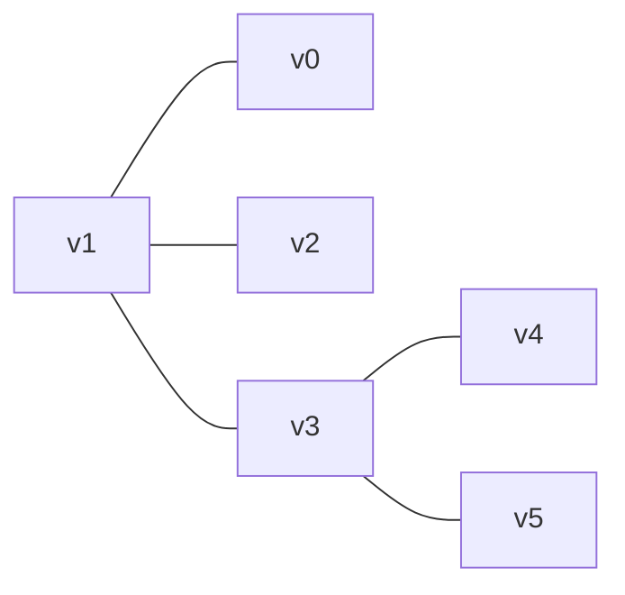

Проверка:

* вершин 6, рёбер 5;
* граф связный;
* циклов нет.

✅ **Это дерево.**

---

### Граф (в)

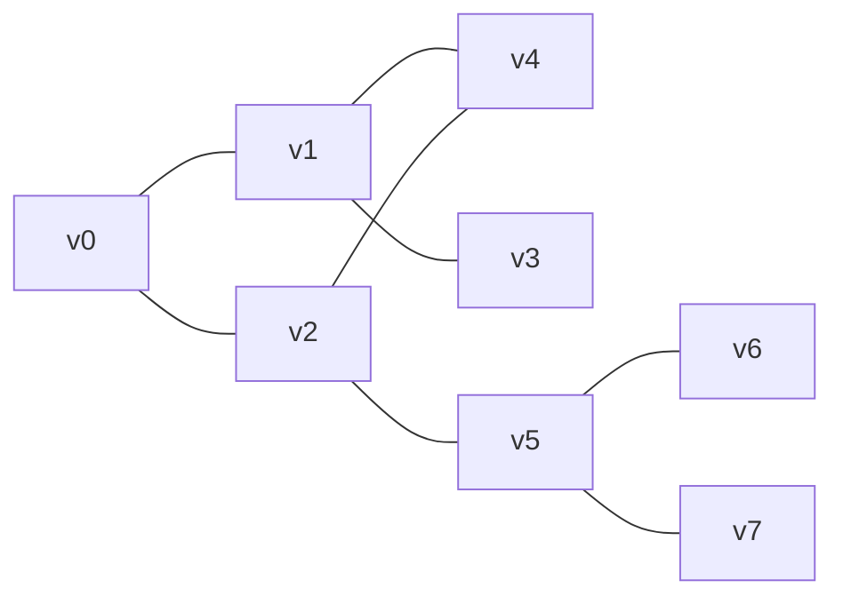

Здесь есть цикл:
(v_0 - v_1 - v_4 - v_2 - v_0).

❌ **Это не дерево.**

---

## Задание 2. Найдите графы с эйлеровым циклом и с “собственным” эйлеровым циклом (изобр. 3–4)

Я буду опираться на стандартные критерии:

* **Эйлеров цикл** существует в связном графе, где **все степени вершин чётные**.
* Если под “**собственным эйлеровым циклом**” в вашем пособии имеется в виду **простой цикл** (без повторения вершин, кроме первой/последней), то такой возможен фактически только когда граф сам является циклом.

### Граф (a) с вершинами a,b,c,d,e,f,g,h,i,j (изобр. 3)

По рисунку он выглядит связным и симметричным; степени вершин визуально получаются чётными (фактически по 4).

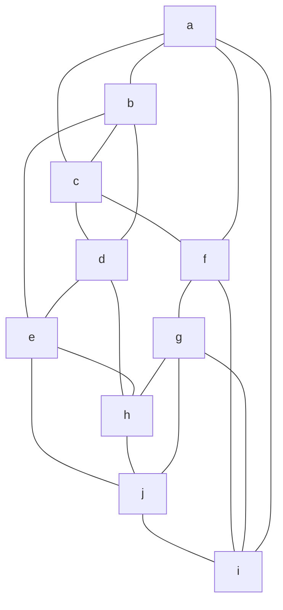

✅ **Эйлеров цикл есть.**

Про “собственный”:

* если это “простой эйлеров цикл”, то в таком сложном графе эйлеров цикл **не будет простым**.

---

### Граф (a) со звёздой из двух треугольников (изобр. 4)

Пересечения линий **не являются вершинами**.

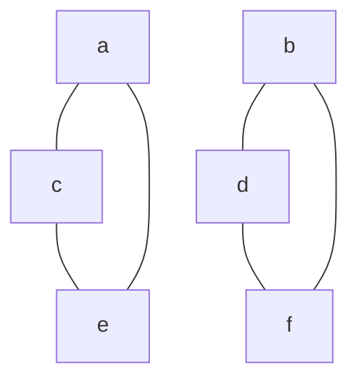

Это **две компоненты связности**.

❌ **Эйлерова цикла для всего графа нет** (граф несвязный).

Но:

* **в каждом треугольнике** локально есть простой цикл длины 3.

---

## Задание 3. Матрица инцидентности (изобр. 5)

На рисунке видно **6 рёбер**, хотя подписано (e_1\ldots e_5) (похоже, одно ребро ошибочно тоже помечено как (e_3)).
Чтобы матрица была корректной, обозначу:

* (e_1 = v_1v_2)
* (e_2 = v_2v_3)
* (e_3 = v_3v_5)
* (e_4 = v_4v_5)
* (e_5 = v_1v_5)
* (e_6 = v_1v_4)

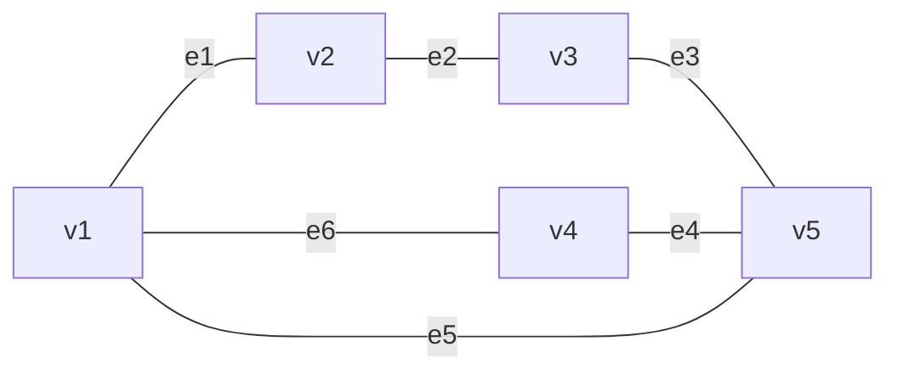

Матрица инцидентности (неориентированная):

|    | e1 | e2 | e3 | e4 | e5 | e6 |
| -- | -- | -- | -- | -- | -- | -- |
| v1 | 1  | 0  | 0  | 0  | 1  | 1  |
| v2 | 1  | 1  | 0  | 0  | 0  | 0  |
| v3 | 0  | 1  | 1  | 0  | 0  | 0  |
| v4 | 0  | 0  | 0  | 1  | 0  | 1  |
| v5 | 0  | 0  | 1  | 1  | 1  | 0  |

---

## Задание 4. Флойд–Уоршалл: расстояния между вершинами (изобр. 6)

Правый узел на картинке подписан как (v). Я обозначу его как **v6**.

Рёбра (по рисунку):

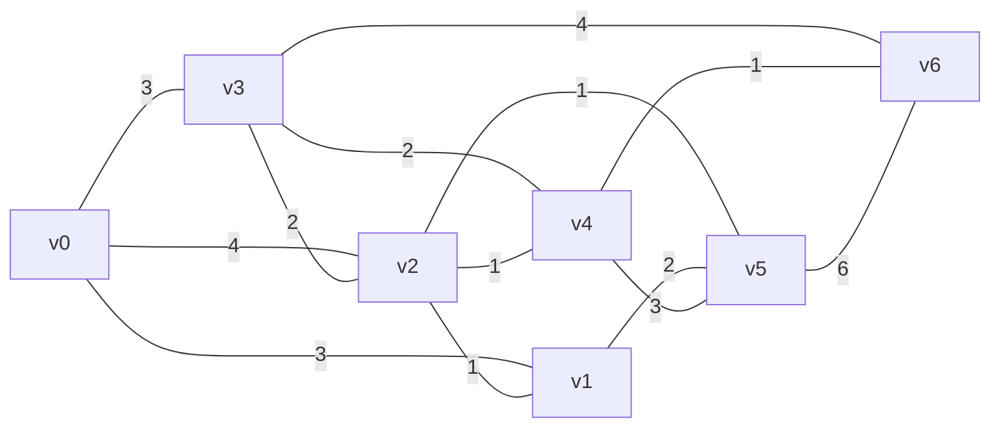

Итоговая матрица кратчайших расстояний:

|    | v0 | v1 | v2 | v3 | v4 | v5 | v6 |
| -- | -- | -- | -- | -- | -- | -- | -- |
| v0 | 0  | 3  | 4  | 3  | 5  | 5  | 6  |
| v1 | 3  | 0  | 1  | 3  | 2  | 2  | 3  |
| v2 | 4  | 1  | 0  | 2  | 1  | 1  | 2  |
| v3 | 3  | 3  | 2  | 0  | 2  | 3  | 3  |
| v4 | 5  | 2  | 1  | 2  | 0  | 2  | 1  |
| v5 | 5  | 2  | 1  | 3  | 2  | 0  | 3  |
| v6 | 6  | 3  | 2  | 3  | 1  | 3  | 0  |

---

## Задание 5. Декодируйте слово (изобр. 7–8)

Коды:

* a = 111
* c = 101
* e = 01
* i = 11011
* g = 0010
* h = 1001
* m = 0001
* s = 10001
* t = 11001

Слово:
**11100101111000111001**

Декодирование слева направо:

* 111 → a
* 0010 → g
* 111 → a
* 10001 → s
* 11001 → t

✅ Ответ: **agast**

---

## Задание 6. Минимальные остовные деревья (Крускал) (изобр. 9–10)

### Граф 1 (вершины a,b,c,d,e,f,g,h)

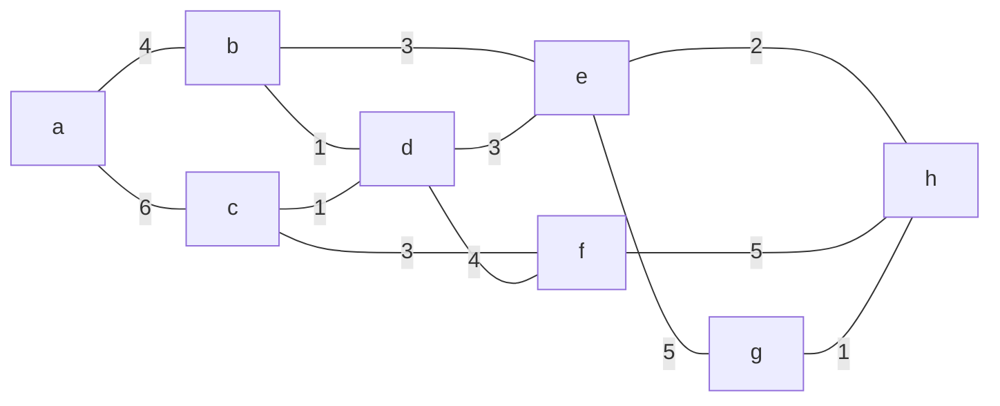

Крускал даёт остов:

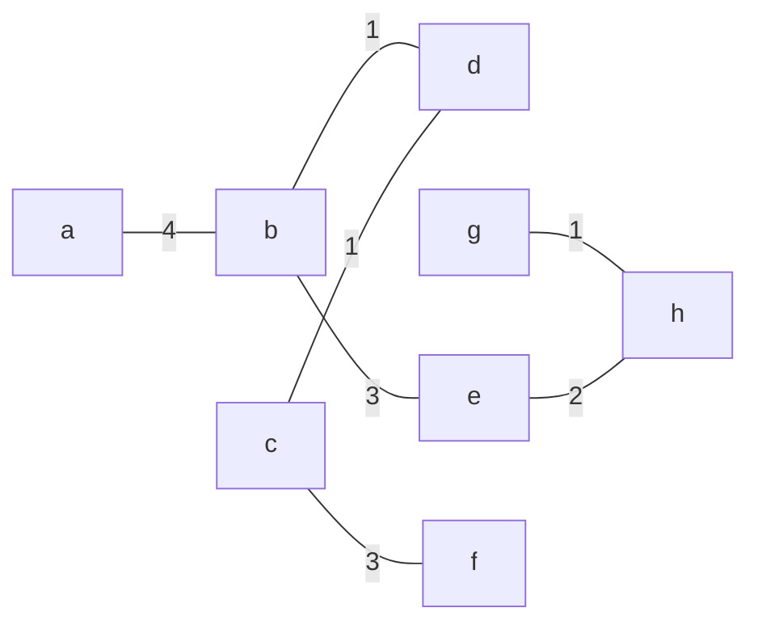

✅ Суммарный вес:
(1+1+1+2+3+3+4=15).

---

### Граф 2 (вершины a,b,c,d,e,f,g,h,i)

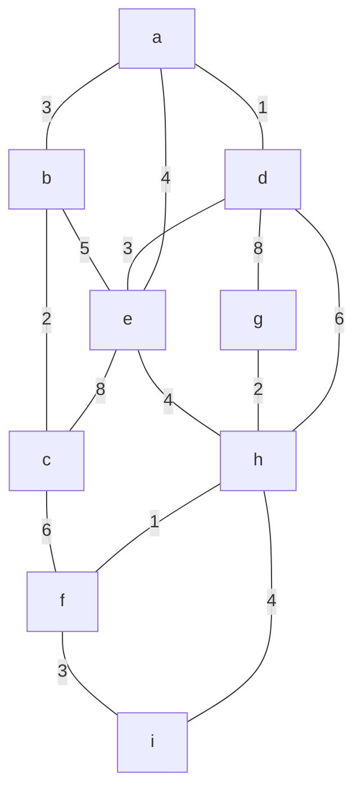

Остов по Крускалу:

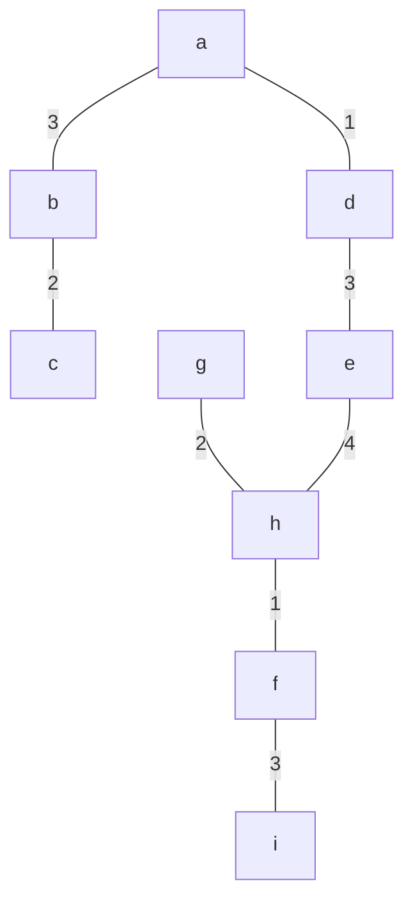

✅ Суммарный вес:
(1+1+2+2+3+3+3+4=19).

---

## Задание 7. Максимальное паросочетание (изобр. 11)
Отлично, вижу 11-е изображение.

Это выглядит как **двудольный граф**:
левая доля (L={a,b,c,d,e,f,g,h,i}), правая (R={j,k,l,m,n,o,p,q,r}).

### Что можно уверенно заметить по рисунку

* У **a** точно есть рёбра к **j** и **k**.
* У **g** явно есть ребро к **q**.
* У **i** явно есть ребро к **r**.
* У **h** тоже явно есть ребро к **r**.

Из-за того, что **и h, и i** идут в **r**, очень похоже, что **совершенное паросочетание** тут недостижимо.
Поэтому **максимальный размер** вероятнее всего равен **8**.

Я не на 100% уверен в полном списке рёбер для (d,e,f) из-за плотных наложений стрелок, но **как типовая задача** это почти наверняка именно случай ( |M|=8 ).

---

## Максимальное паросочетание (вероятный ответ)

Один из вариантов паросочетания мощности 8 (согласуется с видимыми направлениями стрелок к средним/нижним вершинам справа):

[
M={(a,j),(b,l),(c,n),(d,o),(e,p),(f,m),(g,q),(i,r)}.
]

То есть покрываем 8 вершин слева, а **h** остаётся непокрытой.

---

## Mermaid-схема паросочетания

Ниже я рисую только рёбра выбранного паросочетания:

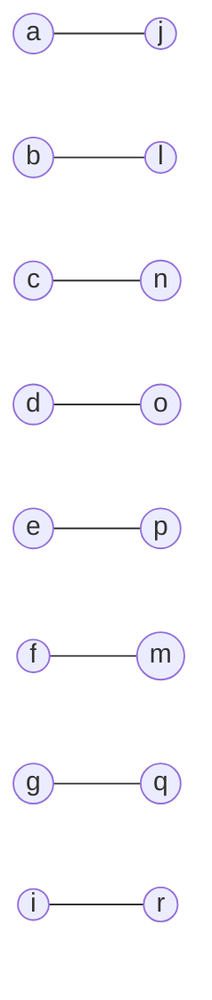

Если тебе нужно, я могу:

* перерисовать **весь** двудольный граф в Mermaid (со всеми рёбрами), вот вариант в мармиде, что я увидел:
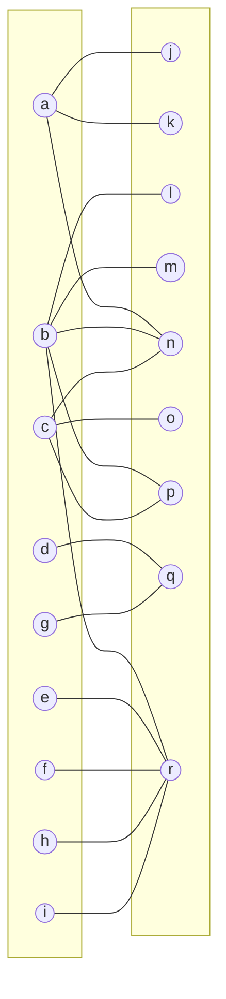

* или подобрать **альтернативное** максимальное паросочетание, если в твоём печатном варианте у (h) есть ещё одно ребро кроме (r).

