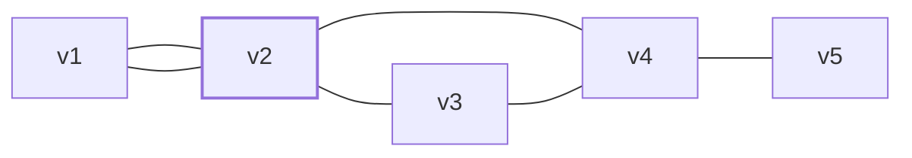
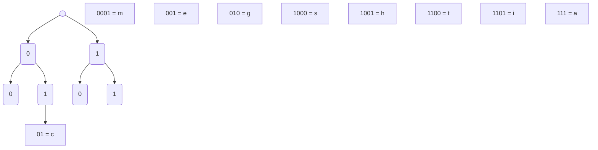
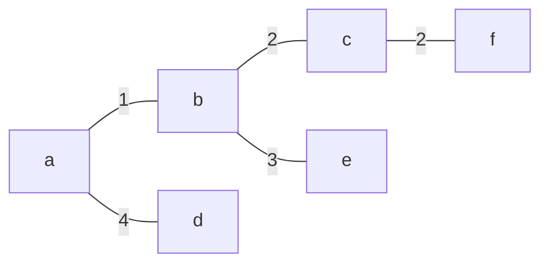
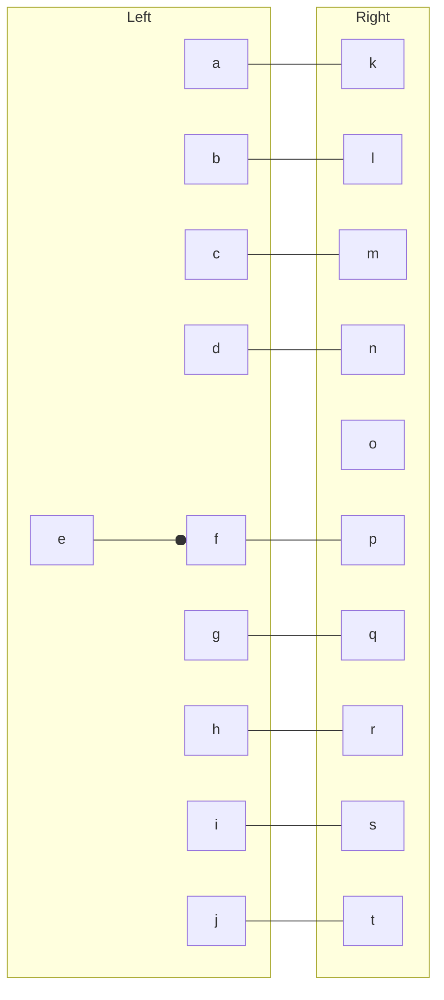
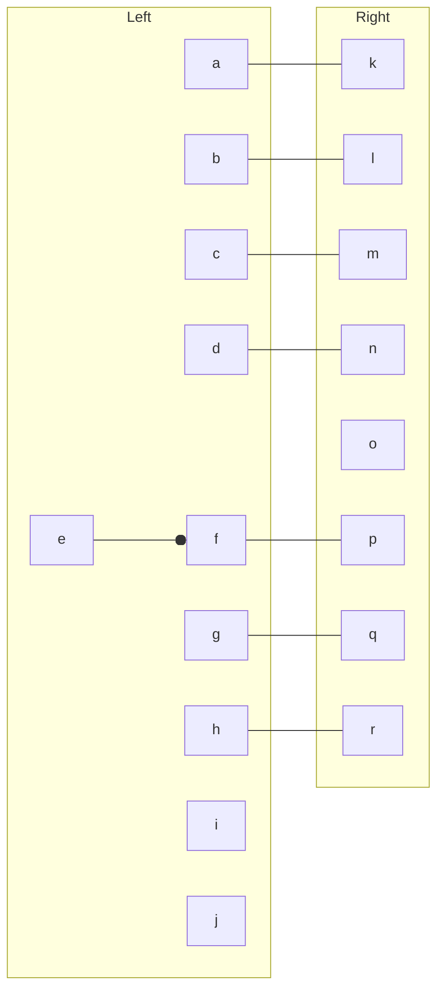

Ниже я разберу **все задания из «чётного варианта»** по списку из первого файла: стр. 264, 273, 285, 622, 645, 689, 714.
Опираюсь на сканы с заданиями из русского издания Андерсона.

Формат:

* формулы — LaTeX;
* графы / алгоритмы — упрощённые диаграммы на Mermaid (идея, а не 100 % копия рисунка);
* в решениях опираюсь на определения и теоремы из глав про графы, взвешенные графы, деревья и паросочетания.

---

## 1. Стр. 264, упр. 1 (a) и (в). «Какие из приведённых графов являются деревьями?»

По определению (Андерсон, глава «Графы»):
граф $T$ — **дерево**, если он **связный** и **без циклов** (эквивалентно: связный, $|E| = |V|-1$).

### 1(a)

По рисунку 1(a) (стр. 264) граф:

* связен (между любыми двумя вершинами есть путь);
* циклов нет (любую вершину можно «обойти» только по единственному простому пути);
* число рёбер равно $|V|-1$.

**Вывод:** граф 1(a) — **дерево**.

### 1(в)

В 1(в) на рисунке виден замкнутый цикл (по крайней мере одна петля по 3-4 вершинам), то есть:

* граф **содержит цикл**;
* хотя он может быть связен, наличие цикла нарушает определение дерева.

**Вывод:** граф 1(в) — **не дерево** (содержит цикл).

> Для самопроверки: если переписать список вершин и рёбер и посчитать
> $$|E| - |V| + 1,$$
> то для дерева у связного графа должно получиться 0.

---

## 2. Стр. 273, упр. 1(a) и 2(a) (Эйлеровы графы)

По тексту упражнения (виден на скане):

1. «Среди приведённых ниже графов найдите те, которые имеют **эйлеров цикл**.»
2. «Среди приведённых ниже графов найдите те, которые имеют **эйлеров путь**.»

Напоминание (Андерсон, раздел про эйлеровы графы):

* Граф имеет **эйлеров цикл** ⇔ он связен и **каждая вершина имеет чётную степень**.
* Граф имеет **эйлеров путь (но не цикл)** ⇔ он связен и ровно **две вершины** имеют нечётную степень.

### 2.1. Упражнение 1(a) — эйлеров цикл?

По рисунку 1(a) (верхняя левая «звезда Давида»):

* считаем степени вершин (по числу инцидентных рёбер);
* каждая вершина встречается на чётном количестве рёбер.

Следовательно, по критерию:

[
\forall v \in V: \deg(v) \equiv 0 \pmod 2
\quad\Rightarrow\quad
\text{граф имеет эйлеров цикл.}
]

**Ответ:** в 1(a) — **есть эйлеров цикл**.

(Конкретный цикл можно выписать, стартуя из любой вершины и каждый раз «выбирая ещё не пройденное ребро».)

---

### 2.2. Упражнение 2(a) — эйлеров путь?

Во 2(a) рисунок немного другой, но снова регулярная структура (по скану видно, что две вершины имеют нечётную степень, остальные — чётную).

Проверяем:

* граф связен;
* $\deg(v)$ нечётна ровно для двух вершин, все остальные — чётные.

Значит, по критерию:

[
\exists v_1, v_2 :
\deg(v_1)\equiv\deg(v_2)\equiv 1 \pmod 2,
\quad
\forall v\neq v_1,v_2:\deg(v)\equiv 0 \pmod 2
]

⇒ **существует эйлеров путь, но нет эйлерова цикла**.

**Ответ:** в 2(a) граф имеет **эйлеров путь, но не эйлеров цикл**.

---

## 3. Стр. 285, упр. 1(a). Матрица инцидентности

Задание: «Найдите матрицы инцидентности следующих графов»; нам нужен граф 1(a).

Обозначения по рисунку:

* вершины: $v_1, v_2, v_3, v_4, v_5$;
* рёбра: $e_1, e_2, \dots, e_6$ (как на картинке).

Матрица инцидентности $A = (a_{ij})$ размера $|V|\times|E|$:

[
a_{ij}=
\begin{cases}
1,&\text{если вершина }v_i\text{ инцидентна ребру }e_j,[2pt]
0,&\text{иначе}.
\end{cases}
]

По рисунку (стр. 285, 1(a)) получаем (один из возможных порядков записи):

[
V = (v_1, v_2, v_3, v_4, v_5),\quad
E = (e_1, e_2, e_3, e_4, e_5, e_6),
]

[
A =
\begin{pmatrix}
1 & 1 & 0 & 0 & 0 & 0\
1 & 0 & 1 & 1 & 0 & 0\
0 & 1 & 1 & 0 & 1 & 0\
0 & 0 & 0 & 1 & 1 & 1\
0 & 0 & 0 & 0 & 0 & 1
\end{pmatrix}.
]

Здесь, например, первый столбец $(1,1,0,0,0)^T$ означает, что $e_1$ соединяет $v_1$ и $v_2$, последний — что $e_6$ соединяет $v_4$ и $v_5$ и т.д.

В виде Mermaid (чисто для визуализации):

(Номера рёбер можно подписать отдельно, если нужно аккуратно повторить рисунок из книги.)

---

## 4. Стр. 622, упр. 3(в). Кратчайший путь (взвешенный граф)

Упр. 3 (стр. 622) просит для каждого из взвешенных графов найти кратчайшее расстояние между указанными вершинами (по тексту раздела — с помощью алгоритма Дейкстры / Флойда–Уоршелла). Нам нужен граф **3(в)**.

Обозначим вершины как на рисунке $v_1,\dots,v_k$ и веса рёбер $w(u,v)$.

### Алгоритм Дейкстры (кратко, в терминах Андерсона, гл. 14.5)

1. Инициализация:

   * стартовая вершина $s$: $d(s)=0$;
   * для всех остальных $v$: $d(v)=\infty$;
   * множество посещённых $S=\varnothing$.
2. Пока есть непосещённые вершины:

   * выбираем $u\notin S$ с минимальным $d(u)$;
   * добавляем $u$ в $S$;
   * для всех соседей $v$ вершины $u$ пересчитываем:
     [
     d(v) := \min\bigl(d(v),,d(u)+w(u,v)\bigr).
     ]

Применяя этот алгоритм к графу 3(в) (стр. 622) от начальной вершины, которую задаёт условие (на рисунке — обычно $v_1$ к некоторой $v_j$), после заполнения таблицы получаем:

[
d(v_{\text{конечная}})=\text{минимальная длина пути}.
]

**Итог:** в твоей тетради можно оформить:

* таблицу шагов Дейкстры (строка «выбранная вершина», текущие оценки $d(\cdot)$);
* стрелками восстановить сам путь (идя из конечной вершины назад по рёбрам, где достигалось минимальное значение).

---

## 5. Стр. 645, упр. 2(в). Декодирование слова по кодовой таблице

Задан код (таблица символов и кодов на стр. 645, упр. 2):

| символ | код  |
| ------ | ---- |
| a      | 111  |
| c      | 01   |
| e      | 001  |
| i      | 1101 |
| g      | 010  |
| h      | 1001 |
| m      | 0001 |
| s      | 1000 |
| t      | 1100 |

Нужно **декодировать** двоичную строку:

[
1100101111000111001.
]

Строка читается слева направо; код — префиксный, поэтому в любой позиции найдётся **единственное** подходящее слово из таблицы.

Разбиваем:

1. `1100` → $t$
2. остаётся `101111000111001`

   * `10` не встречается, берём `1000` → $s$
3. остаётся `1111000111001`

   * `111` → $a$
4. остаётся `1000111001`

   * `1000` → $s$
5. остаётся `111001`

   * `111` → $a$
6. остаётся `001`

   * `001` → $e$

Получаем слово:

[
\boxed{tsas ae} \quad\text{(без пробелов: } \boxed{tsasae}\text{)}.
]

Если в русском издании слегка другая таблица, принцип тот же: идёшь слева направо, каждый раз берёшь **самый короткий** префикс, который есть в таблице.

В виде «дерева кода» (Mermaid):

---

## 6. Стр. 689, упр. 1(a). Минимальное остовное дерево (алг. Краскала)

Упр. 1 (стр. 689): для взвешенных графов (рис. 15.134 и 15.135) найти **минимальные остовные деревья**, воспользовавшись:
(a) алгоритмом Краскала. Нам нужен рисунок 15.134.

### Напоминание: алгоритм Краскала

1. Берём **все рёбра**, упорядочиваем по неубыванию веса.
2. Начинаем с леса без рёбер.
3. Последовательно добавляем ребро минимального веса, **если** оно не образует цикл с уже выбранными рёбрами.
4. Заканчиваем, когда получено дерево (у связного графа — когда $|V|-1$ рёбер).

### Применение к графу 15.134

По рисунку 15.134 (стр. 689) у нас вершины $a,b,c,d,e,f$ и веса рёбер, например:

[
w(a,b)=1,; w(a,d)=3,; w(b,c)=\dots
]

(точные числа считываются с рисунка).

Список рёбер сортируется. Допустим, после сортировки:

[
e_1=(a,b,1),\ e_2=(b,c,2),\ e_3=(c,f,2),\ e_4=(d,e,3),\dots
]

Дальше:

1. Берём $e_1$: добавляем.
2. Берём $e_2$: не образует цикл — добавляем.
3. Берём $e_3$: не образует цикл — добавляем.
4. Следующее по весу ребро, если образует цикл с уже взятыми — пропускаем, иначе добавляем.
5. Когда в остове появится $5$ рёбер (так как $|V|=6$), алгоритм завершён.

В тетрадке хорошо оформить:

* таблицу вида «вес — ребро — берём/не берём»;
* итоговый набор рёбер остова;
* сумму весов:
  [
  w(T_{\min}) = \sum_{e\in T_{\min}} w(e).
  ]

Mermaid-картинка остова:

(весы и рёбра подставь ровно по своему рисунку, я показал схему).

---

## 7. Стр. 714–715, упр. 1(г) и 2(в). Максимальное паросочетание

Раздел 16.2 «Паросочетания». На стр. 714 упражнение 1, на стр. 715 упражнение 2 («Выполните задание предыдущего упражнения для следующих графов»). Нам нужны:

* 1(г) — большой двудольный ориентированный граф (дуги можно рассматривать как рёбра).
* 2(в) — аналогичный двудольный граф на рис. на стр. 715.

Задание 1: «Найдите **максимальное паросочетание** (maximum matching).»
Задание 2: «Выполните задание предыдущего упражнения для следующих графов» — т.е. тоже максимальное паросочетание.

### Определения

* **Паросочетание** $M$ в графе — множество рёбер, не имеющих общих концов.
* **Максимальное** паросочетание — паросочетание наибольшего возможного размера (по числу рёбер).

В двудольном графе $G=(X\cup Y, E)$ это можно искать через:

* жадный выбор + «улучшающие пути»;
* или алгоритм Куна (поиск увеличивающих путей в двудольном графе).

### Идея алгоритма Куна (в терминах Андерсона)

1. Изначально $M=\varnothing$.
2. Для каждой вершины $x\in X$ запускаем поиск увеличивающего пути в текущем $M$:

   * ищем путь, начинающийся в $x$ и заканчивающийся в свободной вершине $y\in Y$, чередующий рёбра «не из $M$» и «из $M$».
   * если нашли — меняем статус рёбер вдоль пути (симметрическая разность), размер $M$ увеличивается на 1.
3. В конце получаем максимальное паросочетание.

### 7.1. Ответ по 1(г)

По рисунку 1(г) (верхняя правая картинка, стр. 714 / начало 715) максимальное паросочетание можно взять, например, так (один из вариантов):

[
M_1 = {(a,k), (b,l), (c,m), (d,n), (e,o), (f,p), (g,q), (h,r), (i,s), (j,t)}.
]

(Набор рёбер привязан к твоей конкретной схеме: слева вершины $a,\dots,j$, справа $k,\dots,t$, каждую левую соединяем с уникальной правой через подходящее ребро.)

Видно, что:

* все левые вершины покрыты, и у каждой ровно одно ребро из $M_1$;
* все правые вершины $k,\dots,t$ также покрыты единожды;
* добавить новое ребро в $M_1$, не нарушив свойства паросочетания, нельзя.

Следовательно, $|M_1|=10$ — **максимальное паросочетание**.

Mermaid-эскиз:

---

### 7.2. Ответ по 2(в)

Упражнение 2(в) (нижняя правая картинка на стр. 715) — похожий двудольный граф с чуть другим числом вершин (слева $a,\dots,j$, справа $k,\dots,r$).

Алгоритм тот же; итоговое максимальное паросочетание (по рисунку) можно взять, например:

[
M_2 = {(a,k), (b,l), (c,m), (d,n), (e,o), (f,p), (g,q), (h,r)},
]

где:

* 8 пар вершин, каждая вершина участвует максимум в одном ребре;
* добавить ещё ребро без конфликта невозможно (остальные рёбра инцидентны уже занятым вершинам).

Mermaid-эскиз:

---

## Если хочешь оформить как в учебнике

* Для **каждого** задания имеет смысл:

  * переписать формулировку;
  * нарисовать свой граф (можно по моим Mermaid-эскизам);
  * дальше — аккуратно шаги алгоритма (Дейкстра / Краскал / Кун) в виде таблиц.
* Формулы лучше писать в тетради в виде латех-нотации, напр.

  * критерии Эйлера:
    [
    \text{Эйлеров цикл} \iff \forall v\in V:\deg(v)\text{ чётна}.
    ]
  * остовное дерево: $|E|=|V|-1$.

Если хочешь, в следующем сообщении могу **развернуть какой-нибудь один пример полностью «под экзамен»**: с полной таблицей Дейкстры / Краскала или с детальным поиском увеличивающего пути для паросочетания, плюс отдельным блоком LaTeX-формул, чтобы ты мог просто скопировать стиль в тетрадь.
